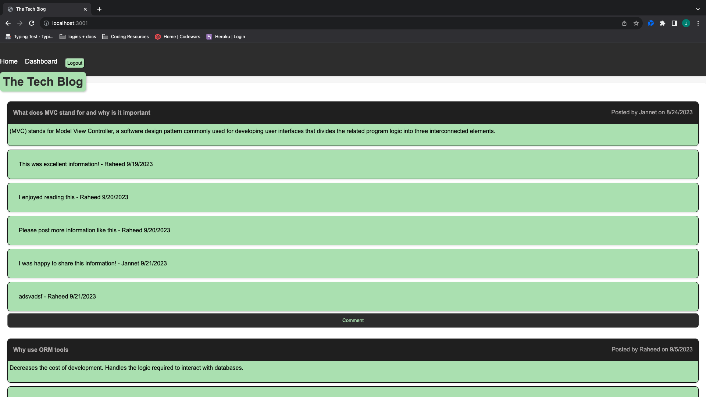

# MVC Tech Blog

## Description

AS A developer who writes about tech
I WANT a CMS-style blog site
SO THAT I can publish articles, blog posts, and my thoughts and opinions

GIVEN a CMS-style blog site
WHEN I visit the site for the first time
THEN I am presented with the homepage, which includes existing blog posts if any have been posted; navigation links for the homepage and the dashboard; and the option to log in 

WHEN I click on the homepage option
THEN I am taken to the homepage 

WHEN I click on any other links in the navigation
THEN I am prompted to either sign up or sign in 

WHEN I choose to sign up
THEN I am prompted to create a username and password 

WHEN I click on the sign-up button
THEN my user credentials are saved and I am logged into the site 

WHEN I revisit the site at a later time and choose to sign in
THEN I am prompted to enter my username and password 

WHEN I am signed in to the site
THEN I see navigation links for the homepage, the dashboard, and the option to log out 

WHEN I click on the homepage option in the navigation
THEN I am taken to the homepage and presented with existing blog posts that include the post title and the date created (currently contains more information than this) 

WHEN I click on an existing blog post
THEN I am presented with the post title, contents, post creator’s username, and date created for that post and have the option to leave a comment 

WHEN I enter a comment and click on the submit button while signed in
THEN the comment is saved and the post is updated to display the comment, the comment creator’s username, and the date created 

WHEN I click on the dashboard option in the navigation
THEN I am taken to the dashboard and presented with any blog posts I have already created and the option to add a new blog post 

WHEN I click on the button to add a new blog post
THEN I am prompted to enter both a title and contents for my blog post 

WHEN I click on the button to create a new blog post
THEN the title and contents of my post are saved and I am taken back to an updated dashboard with my new blog post 

WHEN I click on one of my existing posts in the dashboard
THEN I am able to delete or update my post and taken back to an updated dashboard 

WHEN I click on the logout option in the navigation
THEN I am signed out of the site 

WHEN I am idle on the site for more than a set time
THEN I am able to view posts and comments but I am prompted to log in again before I can add, update, or delete posts 

## Table of Contents

- [Installation](#installation)

- [Usage](#usage)

- [Questions](#questions)

## Installation

- Step 1: The user will need to have [Node.js](https://nodejs.org/en/download) installed on their PC or use the link provided to install it.

- Step 2: Before running the program the user will need to install the packages by typing 'npm install' into the terminal integrated to the location of the folder holding the program.

- Step 3: the user will need to set up a 

- Step 3: The user will need to have a Heroku installed on their PC, this can be achieved by typing 'npm install -g heroku' into their terminal.

- Step 4: Heroku will need to be linked to your GitHub account. This can be accomplished after creating the app, under deployment method select GitHub.

## Usage

This website was designed ot have users login, or sign up, to access a tech blog post. On the homepage they can view others posts and comments as well as add their own comments to others posts. On their dashboard they can create their own posts and then either update those existing posts or delete them. 

## Questions

Regarding any questions please check out my Github profile [JakeHowdeshell](https://github.com/JakeHowdeshell/node.js-readme-generator/tree/main).

Or send me an [email](mailto:Jakehowdy@gmail.com).
